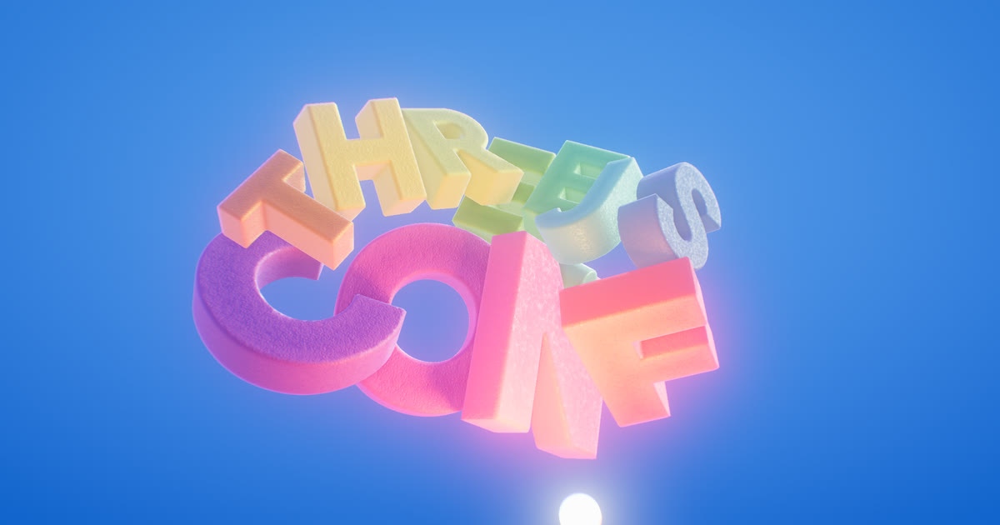

# THREE.JS CONF

A physics toy for THREE.JS CONF 2026.

**[Try it →](https://spite.github.io/threejs-conf/)**

The title is built as real geometry rather than drawn as text: each letter is pulled out of a
TrueType font, turned into a solid mesh, and handed to a physics engine. You can shove the
letters around with the mouse, gather them onto a light, and throw them. They knock into each
other, they make noise, and they drift back into place when you leave them alone.

[](https://spite.github.io/threejs-conf/)

## The pieces

**The letters.** Each glyph's outline is read from the font with **opentype.js**, measured into a distance field —
for every point on a grid, how far is it from the edge of the letter — and that field is turned
into a mesh with marching cubes. Doing it this way gives rounded, slightly swollen letterforms
instead of flat extrusions, and the holes come out for free.

**The physics.** Runs on **Ammo.js**, a build of the Bullet engine. Every letter gets a
collision shape built from its own outline, chopped into
convex pieces so it can collide accurately rather than as a box. A spring holds each one near
its home position, so however hard you throw them, the title reassembles itself.

**The look.** Built on **three.js**, but rendering through a custom pipeline rather than its
built-in materials: the scene is drawn once into several buffers (colour, position, normal, motion,
light), and the lighting, shadows, occlusion, bloom, fog and lens effects are all worked out
afterwards from those. That's what allows the soft contact shadows and the shadow cast by the
light you're dragging around.

**The surface.** The speckled texture on each letter is thousands of tiny copies of that same
letter, stamped at random sizes and angles on the GPU, then converted into a bump map, inspired
by the PS5 textured controller.

**The sound.** Plain **Web Audio**, no library. Nothing here is a recording apart from two
knock samples. The hum, the whoosh
of a letter flying past, the drone in the background and the wobble of the light sphere are
all generated live and positioned in 3D, so they pan and pitch-shift as things move.

## Controls

- **Drag** to orbit, **scroll** to zoom
- **Move** the mouse to nudge the letters
- **Hold** to gather them onto the light, **release** to throw them
- **Shift** gathers them without clicking
- **Alt** lets you orbit without disturbing them
- **F** goes fullscreen
- **Space** pauses, **Tab** hides the panel

The panel has a Quality row (Low to Ultra) if it runs hot, and everything else is
tweakable — Copy Link puts the current settings in the URL so you can share a look.

## Layout

- `index.html` — entry point: importmap, meta tags, GUI container
- `main.js` — scene setup, input, and the render loop
- `modules/` — the sketch's own code: letter building, physics, audio, the render pipeline, GUI
- `shaders/` — every piece of GLSL, imported as chunks
- `third_party/` — three.js and Ammo
- `assets/` — font, environment map, two impact samples
- `css/` — page and loading-screen styles

## Built with

|                                                   |                                        |
| ------------------------------------------------- | -------------------------------------- |
| [three.js](https://threejs.org) r182              | rendering, vendored in `third_party/`  |
| [Ammo.js](https://github.com/kripken/ammo.js)     | Bullet physics compiled to WebAssembly |
| [opentype.js](https://opentype.js.org) 2.0        | reading glyph outlines out of the font |
| [guspira](https://github.com/spite/guspira) 0.1.1 | the GUI panel and the reactive params  |
| [esbuild](https://esbuild.github.io)              | bundling `dist/` for release           |
| Web Audio                                         | all the sound, no library              |

A few smaller pieces are adapted rather than imported: the marching-cubes tables come from
three.js's own `MarchingCubes` addon, the separable Gaussian kernels from
[glsl-fast-gaussian-blur](https://github.com/Jam3/glsl-fast-gaussian-blur), the pink-noise
filter from Paul Kellett's well-travelled coefficients, and the dither uses Jorge Jimenez's
interleaved gradient noise.

The font is Google Sans Flex, the environment map is a Poly Haven HDRI, and the two impact
samples are from [freesound](https://freesound.org).

## Run

```sh
npm install
npm start
```

Needs a static server — it uses ES modules and an importmap, and has to reach `node_modules/`.

## Publish

```sh
npm run build     # bundles into dist/
npm run deploy    # builds, then pushes dist/ to Cloudflare
```
